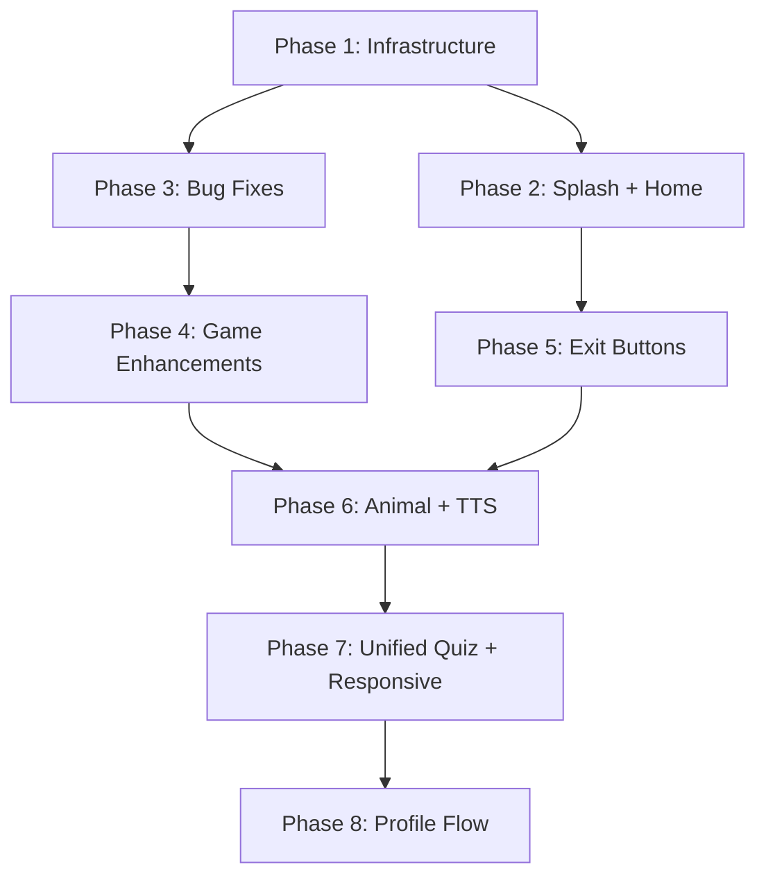

# 🎮 Kidzoo — Implementation Plan

> **Architecture Rule:** Zero `static` variables. All state flows through BLoC/Cubit. All game state is instance-owned.
> **Widget Rule:** Class widgets only — no functional widgets.

---

## 📁 Current Architecture Snapshot

| Layer | Tech |
|---|---|
| State | `flutter_bloc` (BLoC + Cubit) |
| Local DB | `drift` — `Profiles` table only (id, name, age, gender, createdAt) |
| Audio | `audioplayers` |
| Localization | Custom `AppLocalizations` + `LanguageCubit` |
| TTS | `flutter_tts` |
| Game engine | `flame` (ColorSwitch, FlappyBird) |
| Animations | `flutter_animate`, `lottie`, `confetti` |
| Orientation | Portrait-locked in `main.dart` (must be unlocked for tablet/landscape) |

---

## 🗂️ Phase Overview

| Phase | Focus | Items |
|---|---|---|
| **1** | Foundation & Infrastructure | DB schema, responsive unlock, exit button base, Lottie/sound assets |
| **2** | Splash & Home Polish | #1 Splash animation, #2 Language/music buttons |
| **3** | Bug Fixes — Games | #3 Dots touch, #7 Level map number, #8 Color memory dialog |
| **4** | Game Enhancements | #4 Paddle AI, #5 Missing letter image, #10 Color switch hard level |
| **5** | Exit Buttons | #6 Exit buttons for all games |
| **6** | Animal & TTS | #12 Animal sounds, #13 Egyptian Arabic TTS |
| **7** | Unified Education | #11 Quiz-Based Learning Engine (Vehicles/Fruits/Veg), #9 Responsive landscape |
| **8** | Profile & Onboarding | #15 Mandatory Profile Setup, #16 Balloon hunt |

---

## 🔵 Phase 1 — Foundation & Infrastructure

### 1.1 — Database: Extend `Profiles` + New `GameScores` Table

**Why:** Profile & score system (task #15) needs a score table per profile. Extend now so later phases have it.

**Files to change:**
- `lib/core/database/tables/profile_table.dart` — add `avatarIndex`, `totalPoints`
- `lib/core/database/tables/game_scores_table.dart` *(new)*
- `lib/core/database/config.dart` — add `GameScores` to `@DriftDatabase`, bump `schemaVersion` to 2 with migration
- `lib/core/database/daos/game_scores_dao.dart` *(new)*
- Run `dart run build_runner build`

```dart
// game_scores_table.dart  (no static variables)
class GameScores extends Table {
  IntColumn get id         => integer().autoIncrement()();
  IntColumn get profileId  => integer().references(Profiles, #id)();
  TextColumn get gameKey   => text()();          // e.g. "flappy_bird"
  IntColumn get score      => integer()();
  IntColumn get level      => integer().nullable()();
  DateTimeColumn get playedAt => dateTime()();
}
```

**Profile table additions:**
```dart
IntColumn  get avatarIndex  => integer().withDefault(const Constant(0))();
IntColumn  get totalPoints  => integer().withDefault(const Constant(0))();
```

**Migration (schemaVersion 2):**
```dart
@override
MigrationStrategy get migration => MigrationStrategy(
  onUpgrade: (m, from, to) async {
    if (from < 2) {
      await m.addColumn(profiles, profiles.avatarIndex);
      await m.addColumn(profiles, profiles.totalPoints);
      await m.createTable(gameScores);
    }
  },
);
```

### 1.2 — Unlock Landscape Orientation

**File:** `lib/main.dart`

Remove the `setPreferredOrientations` call. Responsive layouts will handle UI per phase 7.

### 1.3 — Shared Exit Button Base Widget

**File:** `lib/core/widgets/game_exit_button.dart` *(new)*

A reusable `GameExitButton` class widget — displays an `X` icon in the top-left corner with a confirm dialog. Used by all games in Phase 5.

```dart
class GameExitButton extends StatelessWidget {
  final VoidCallback? onExit;           // custom action or Navigator.pop
  final Color iconColor;
  const GameExitButton({this.onExit, this.iconColor = Colors.white, super.key});

  @override
  Widget build(BuildContext context) { ... }
}
```

### 1.4 — Assets Audit & Required Additions

> [!IMPORTANT]
> The following asset folders need to be created and populated before implementing features.

#### 🎨 Images needed

| Folder | Files | Used by |
|---|---|---|
| `assets/gen/images/fruits/` | apple, banana, grape, orange, strawberry, watermelon, mango, pear (PNG/SVG) | Task #11 |
| `assets/gen/images/vegetables/` | carrot, broccoli, tomato, onion, cucumber, potato, corn, lettuce (PNG/SVG) | Task #11 |
| `assets/gen/images/vehicles/` | car, bus, bicycle, truck, airplane, boat, train, motorcycle (PNG/SVG) | Task #11 |
| `assets/gen/images/scenes/` | sky, road, sea, runway (PNG/SVG) | Task #11 |
| `assets/gen/images/missing_letter/` | One image per word (cat, dog, sun, etc.) — already need per task #5 | Task #5 |
| `assets/gen/images/avatar/` | 6–8 cute kid avatar illustrations | Task #15 |


#### 🔊 Audio files needed

| File | Used by |
|---|---|
| `assets/audio/animals/cat_meow.mp3` | Task #12 |
| `assets/audio/animals/dog_bark.mp3` | Task #12 |
| `assets/audio/animals/cow_moo.mp3` | Task #12 |
| `assets/audio/animals/lion_roar.mp3` | Task #12 |
| `assets/audio/animals/duck_quack.mp3` | Task #12 |
| `assets/audio/animals/elephant_trumpet.mp3` | Task #12 |
| `assets/audio/animals/frog_croak.mp3` | Task #12 |
| `assets/audio/animals/horse_neigh.mp3` | Task #12 |

#### 🎞️ Lottie files needed

| File | Used by |
|---|---|
| `assets/gen/lottie/splash_rocket.json` | Task #1 (or use existing) |
| `assets/gen/lottie/confetti.json` | Task #15 |
| `assets/gen/lottie/balloon_float.json` | Task #16 |

> [!NOTE]
> Free sources: [LottieFiles](https://lottiefiles.com), [FlatIcon](https://flaticon.com) for PNGs, [SVGRepo](https://svgrepo.com) for SVGs. Use child-friendly, colorful, cartoon-style assets.

#### Update `pubspec.yaml` asset sections

```yaml
- assets/gen/images/fruits/
- assets/gen/images/vegetables/
- assets/gen/images/vehicles/
- assets/gen/images/scenes/
- assets/gen/images/missing_letter/
- assets/gen/images/avatar/
- assets/gen/images/balloons/
- assets/audio/animals/
```

---

## 🟡 Phase 2 — Splash & Home Polish

### Task #1 — Splash Screen: "Powered by Annotex" Funny Animation

**New file:** `lib/features/Splash/splash_screen.dart`

**Approach:**
- `SplashScreen` is a `StatefulWidget` with `TickerProviderStateMixin`
- Animation sequence:
  1. App logo bounces in (scale + elastic curve) using `flutter_animate`
  2. Lottie rocket / confetti plays underneath/above
  3. After 1.5 s, "Powered by Annotex" slides up with a funny wobble
  4. After 3 s total, navigate to `CharacterSelectionScreen`
- **No static variables** — use `AnimationController` instances owned by state

```dart
class SplashScreen extends StatefulWidget { ... }

class _SplashScreenState extends State<SplashScreen>
    with TickerProviderStateMixin {
  late AnimationController _logoController;
  late AnimationController _taglineController;
  // ...
}
```

**Wire in `main.dart`:** Change `home:` from `CharacterSelectionScreen` to `SplashScreen`.

---

### Task #2 — Home Header: Language & Music Buttons

**File:** `lib/features/home/UI/widgets/header_section.dart`

Replace the static `Icons.search` and `Icons.menu` icons with functional icon buttons:

```
[🌐 Language] [🎵 Music Toggle] [⚙️ Settings (existing)]
```

- `LanguageIconButton` — taps open `LanguageSettingsScreen` (already exists at `lib/core/localization/language_settings_screen.dart`)
- `MusicToggleIconButton` — reads/writes `MusicCubit` state, shows `Icons.music_note` / `Icons.music_off`

Both are **separate named class widgets**, not inline functions.

---

## 🔴 Phase 3 — Bug Fixes

### Task #3 — Dots & Boxes: Fix Touch-Sensitive Line Drawing

**File:** `lib/features/DotsAndBoxes/UI/dots_and_boxes_screen.dart`

**Root cause analysis needed:** Read the `GestureDetector` / `PanGestureRecognizer` logic. The fix likely involves:
- Replacing `onTap` detection with `GestureDetector.onPanUpdate` + `onPanEnd`
- Using `HitTestBehavior.opaque` to prevent gesture absorption
- Computing the nearest edge from pointer position using bounding-box math instead of exact tap

**Implementation pattern:**
```dart
GestureDetector(
  behavior: HitTestBehavior.opaque,
  onPanStart: _onPanStart,
  onPanUpdate: _onPanUpdate,
  onPanEnd: _onPanEnd,
  child: CustomPaint(...),
)
```

No static variables — store pan start position in state fields.

---

### Task #7 — Level Map: Fix Floating Numbers Outside Circle

**File:** `lib/features/LevelsMap/levelmap_screen.dart`

**Root cause:** Text label likely positioned absolutely without centering within the `Stack`/circle widget.

**Fix:** Ensure each level button uses `Center` + `FittedBox` or constrains `Text` font size with `FittedBox`:

```dart
FittedBox(
  fit: BoxFit.scaleDown,
  child: Text(
    '${level}',
    style: const TextStyle(fontSize: 18, fontWeight: FontWeight.bold),
  ),
)
```

Also verify `CircleAvatar` / `Container` radius matches the enclosing widget's `constraints`.

---

### Task #8 — Color Memory: Dialog Triggers Next Round Automatically

**File:** `lib/features/ColorMemoryGame/UI/color_memory_screen.dart`

**Root cause:** When `GamePhase.success` fires, the `BlocConsumer` listener shows `SuccessDialog` but the BLoC simultaneously (in the same emission) schedules `NextRoundEvent` internally — or the `BlocConsumer` is rebuilding while dialog is open, triggering another event.

**Fix strategy:**
1. Add a `bool _isDialogOpen` flag on the **state class** (not static) — or better: add a `GamePhase.awaitingContinue` phase so the BLoC parks and never auto-advances
2. Only dispatch `NextRoundEvent` from the dialog's "Continue" button, never automatically inside the BLoC
3. Ensure `barrierDismissible: false` prevents tapping outside

**BLoC change:** Remove any `Timer` or auto-trigger of `NextRoundEvent` in `_onSuccess` handler. The game waits in `awaitingContinue` until the user taps Continue.

---

## 🟠 Phase 4 — Game Enhancements

### Task #4 — Paddle Bounce: Smarter AI

**File:** `lib/features/PaddleBounce/UI/paddle_bounce_game_screen.dart`

**AI paddle algorithm (no statics):**

The AI difficulty is stored in the `PaddleBounceGameState` (cubit/bloc) as an `AiDifficulty` enum: `easy | medium | hard`.

```dart
enum AiDifficulty { easy, medium, hard }
```

For each difficulty level, the AI paddle tracks the ball's Y position with a reaction speed multiplier and optional prediction:

```dart
double _computeAiPaddleTarget({
  required double ballY,
  required double ballVy,  // ball vertical velocity
  required double aiPaddleY,
  required double dt,
  required AiDifficulty difficulty,
}) {
  // hard: predict ball position 2 frames ahead
  final predicted = difficulty == AiDifficulty.hard
      ? ballY + ballVy * dt * 2
      : ballY;

  final speed = switch (difficulty) {
    AiDifficulty.easy   => 80.0,
    AiDifficulty.medium => 160.0,
    AiDifficulty.hard   => 260.0,
  };

  return aiPaddleY + (predicted - aiPaddleY).clamp(-speed * dt, speed * dt);
}
```

The game screen passes `AiDifficulty.hard` from a difficulty selector in `PaddleBounceMenuScreen`.

---

### Task #5 — Missing Letter: Add Word Images

**Files:**
- `lib/features/MissingLetterGame/Data/` — word model, add `imagePath` field
- `lib/features/MissingLetterGame/Ui/missing_letter_screen.dart` — render image above the blanks

**Word model update:**
```dart
class MissingLetterWord {
  final String word;
  final String hint;
  final String imagePath;       // e.g. 'assets/gen/images/missing_letter/cat.png'
  final int missingIndex;

  const MissingLetterWord({
    required this.word,
    required this.hint,
    required this.imagePath,
    required this.missingIndex,
  });
}
```

Add `Image.asset(word.imagePath)` in the game UI with a rounded card container above the letters row.

---

### Task #10 — Color Switch: Points Counter + Hard Level (5-color Circle)

**File:** `lib/features/ColorSwitchGame/color_switch_game.dart`

**Current behavior:** Advances to 4 advanced colors at score 10.

**New behavior:**
- Score 0–9: 4-color ring (existing basic)
- Score 10–19: 4-color ring (existing advanced)  
- Score ≥ 20: 5-color ring (new `ultraColors`)

```dart
static const List<Color> _ultraColors = [
  Colors.cyanAccent,
  Colors.purpleAccent,
  Colors.orangeAccent,
  Colors.pinkAccent,
  Colors.tealAccent,   // 5th color
];
```

The `CircleRotator` component must accept a dynamic `List<Color>` rather than reading a global list.

**Points counter UI:** Add a `ScoreCounterWidget` (class widget) overlay on `ColorSwitchScreen` that reads score from `ColorSwitchGame.score` via a `ValueNotifier<int>` passed into the game — avoids static variables.

```dart
// In ColorSwitchGame:
final ValueNotifier<int> scoreNotifier = ValueNotifier(0);

void incrementScore() {
  score++;
  scoreNotifier.value = score;
  // ...
}
```

---

## 🟢 Phase 5 — Exit Buttons for All Games

### Task #6 — Unified Exit Button Across All Games

Use the `GameExitButton` widget created in Phase 1.3.

**Games to update** (add `GameExitButton` to their `Stack`/`Scaffold`):

| Game | File |
|---|---|
| Flappy Bird | `flappy_bird_screen.dart` |
| Tic Tac Toe | `tic_tac_toe_game.dart` |
| Missing Letter | `missing_letter_screen.dart` |
| Paddle Bounce | `paddle_bounce_game_screen.dart` |
| Dots & Boxes | `dots_and_boxes_screen.dart` |
| Maze Game | `lib/features/MazeGame/` |
| Puzzle | `lib/features/Puzzle/` |
| Color Memory | `color_memory_screen.dart` |
| Color Switch | `color_switch_screen.dart` |
| Flag Game | `flag_game_menu_screen.dart` |
| Memory Game | `lib/features/MemoryGame/` |

**Pattern:**
```dart
Stack(
  children: [
    GameWidget(game: _game),
    const Positioned(
      top: 16,
      left: 16,
      child: SafeArea(child: GameExitButton()),
    ),
  ],
)
```

---

## 🟣 Phase 6 — Animal Sounds & TTS Enhancement

### Task #12 — Animal Sounds in Animal Name Game

**File:** `lib/features/AnimalNameGame/data/` — model update  
**File:** `lib/features/AnimalNameGame/UI/animal_name_game_screen.dart`

**Animal model:**
```dart
class AnimalItem {
  final String nameEn;
  final String nameAr;
  final String imagePath;
  final String soundPath;   // e.g. 'audio/animals/cat_meow.mp3'

  const AnimalItem({
    required this.nameEn,
    required this.nameAr,
    required this.imagePath,
    required this.soundPath,
  });
}
```

**Play sequence when animal is shown:**
1. TTS speaks the animal name (language-aware)
2. After TTS completes (`onComplete` callback), `AudioPlayer` plays `soundPath`

**Cubit (`AnimalNameGameCubit`) changes:**
- Accept `AudioPlayer` instance via constructor (no static)
- Method `playAnimalSequence(AnimalItem animal)` orchestrates TTS → sound

---

### Task #13 — Egyptian Arabic TTS

**File:** `lib/core/services/cubit/music_cubit.dart` or a new `lib/core/services/tts_service.dart`

**Implementation:**
```dart
class TtsService {
  final FlutterTts _tts = FlutterTts();

  Future<void> configure(Locale locale) async {
    if (locale.languageCode == 'ar') {
      await _tts.setLanguage('ar-EG');        // Egyptian Arabic BCP-47
      await _tts.setSpeechRate(0.45);          // slower = clearer for kids
      await _tts.setPitch(1.1);
    } else {
      await _tts.setLanguage('en-US');
      await _tts.setSpeechRate(0.5);
      await _tts.setPitch(1.0);
    }
  }

  Future<void> speak(String text) => _tts.speak(text);
  Future<void> stop() => _tts.stop();
}
```

`TtsService` is provided via `BlocProvider`/dependency injection — not a static singleton.

> [!WARNING]
> `ar-EG` availability depends on the device TTS engine. Add a fallback to `ar` if `ar-EG` is unavailable using `getLanguages()` check at init.

---

## 🔵 Phase 7 — Unified Education Quiz Engine & Responsive Layouts

### Task #11 — Unified Education Quiz Engine (Vehicles, Fruits, Vegetables)

**Core Concept:** Quiz-Based Learning Engine
All three education games (Vehicles, Fruits, Vegetables) MUST be unified under a single shared engine.
No separate logic per game. Only data differences (assets + questions).

**Shared Core Engine Architecture:**
- **Cubit:** `QuizCubit`
- **Models:** `QuizQuestionModel`, `QuizOptionModel`
- **UI Components:** `QuizSceneCard`, `QuizImageCard`, `QuizOptionsRow`, `QuizFeedbackDialog`

**1. Vehicles Game (Scene-Based Question Game):**
Each round shows a scene, a question, and 3 multiple-choice answers.
- **Sky Scene:** Background (sky/clouds/runway). Question: “Which vehicle can fly in the sky?”. Options: ✈️ Airplane (correct), 🚗 Car, 🚌 Bus.
- **Road Scene:** Question: “Which vehicle moves on the road?”. Options: 🚗 Car (correct), ✈️ Airplane, 🚤 Boat.
- **Sea Scene:** Question: “Which vehicle moves in water?”. Options: 🚤 Boat (correct), 🚗 Car, ✈️ Airplane.

**2. Fruits & Vegetables Games:**
Image → Choose Correct Name structure.
- Example: Image: 🍎 Apple. Options: Apple (correct), Banana, Orange.

**Feedback Rules:**
- **Correct Answer:** Show “Correct! This is an [item]”, Play TTS (English or Arabic), Trigger confetti animation, Increase score.
- **Wrong Answer:** Show “Try again”, Shake animation, No score penalty.

**New feature folders:**
```text
lib/features/QuizEngine/
lib/features/QuizEngine/data/
lib/features/QuizEngine/ui/
lib/features/QuizEngine/bloc/
```

**Add to `AppCategory` education list** in `app_category_options.dart`.

---

### Task #9 — Responsive Layouts (Tablet & Desktop Landscape)

**Approach:** `LayoutBuilder` + breakpoints — no static variables.

**Breakpoints (define as `const` values in a `BreakPoints` class, not statics):**
```dart
abstract final class ScreenBreakpoints {
  static const double tablet = 600;
  static const double desktop = 1024;
}
```

**Files to update:**
- `lib/main.dart` — remove orientation lock
- `lib/features/AppCategory/app_category_options.dart` — `OptionsGrid` crossAxisCount: 2 → 3 (tablet) → 4 (desktop)
- `lib/features/LevelsMap/levelmap_screen.dart` — scale circle sizes relative to screen width
- `lib/features/home/UI/home_screen.dart` — responsive padding and layout
- All game screens — wrap with `OrientationBuilder` where needed

**Responsive helper (no statics):**
```dart
class ResponsiveLayout extends StatelessWidget {
  final Widget mobile;
  final Widget? tablet;
  final Widget? desktop;
  const ResponsiveLayout({required this.mobile, this.tablet, this.desktop, super.key});

  @override
  Widget build(BuildContext context) {
    return LayoutBuilder(builder: (context, constraints) {
      if (constraints.maxWidth >= ScreenBreakpoints.desktop) {
        return desktop ?? tablet ?? mobile;
      } else if (constraints.maxWidth >= ScreenBreakpoints.tablet) {
        return tablet ?? mobile;
      }
      return mobile;
    });
  }
}
```

---

## ⚫ Phase 8 — Profile/Score System

### Task #15 — Mandatory Profile Onboarding & Score Points

**Architecture:**
- `ProfileCubit` (new) — wraps `ProfileDao`, emits `ProfileState`
- `ScoreCubit` (new) — wraps `GameScoresDao`, emits top scores per profile
- `ProfileSetupScreen` — shown MANDATORILY after splash.
- `ProfileScreen` — shows avatar, name, total points, per-game best scores

**Profile flow (NEW ONBOARDING FLOW):**
```text
SplashScreen
   ↓
Profile Setup Screen (NEW)
   ↓
HomeScreen
```

**Score award:** After each game completes, call:
```dart
context.read<ScoreCubit>().recordScore(
  profileId: activeProfileId,
  gameKey: 'flappy_bird',
  score: finalScore,
  level: currentLevel,
);
```

`ScoreCubit` inserts into `GameScores` table and updates `Profiles.totalPoints`.

---


## 📋 Summary: Assets & SVGs by Task

| Task | Asset Type | Files |
|---|---|---|
| #1 Splash | Lottie | `splash_rocket.json` or `splash_confetti.json` |
| #1 Splash | PNG | App logo (existing) |
| #5 Missing Letter | PNG/SVG | ~20 word images (cat, dog, sun, hat, etc.) |
| #11 Quiz Engine | PNG/SVG | 8 fruits, 8 vegetables, 8 vehicles, 4 scenes (sky, road, sea, runway) |
| #12 Animal sounds | MP3/WAV | 8+ animal sounds (meow, bark, moo…) |
| #15 Profile | PNG/SVG | 6–8 cute kid avatars |


> [!TIP]
> Use cartoon/flat-design style assets consistent with the existing Kidzoo art style. Recommended free libraries: **FlatIcon** (PNG), **SVGRepo** (SVG), **LottieFiles** (Lottie JSON), **Pixabay** (audio).

---

## 🔧 New Packages Required

| Package | Version | Use |
|---|---|---|
| `flutter_tts` | already installed | Task #13 |
| `audioplayers` | already installed | Tasks #12, #14, #16 |
| `lottie` | already installed | Task #1 |
| `flutter_animate` | already installed | Task #1 |
| *(no new packages required)* | — | All tasks use existing deps |

---

## 📅 Execution Order



> [!NOTE]
> Phases 2 and 3 can be worked in parallel. Phase 8 depends on Phase 1 (DB schema) being complete.
